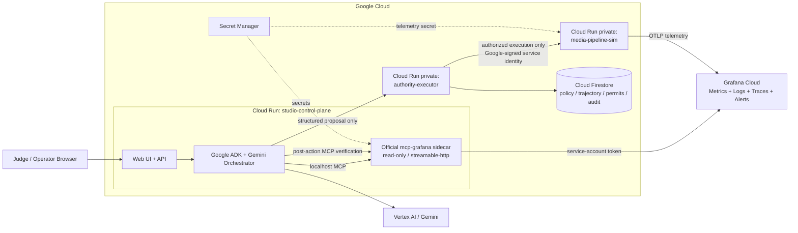

# BOSAI Studio Control Plane — Phase 2 Architecture V1 Lock

Status: **LOCKED CANDIDATE**  
Issue: **#3 — PHASE 2 — Architecture V1 Lock**  
Architecture version: **BSC-P2-ARCH-V1.0**  
Topology mode: **ISOLATE**  
Base branch: `air`  
Base SHA: `9b446ce9fed9c8f5f3040f50fe355a9f72205a32`  
Working branch: `phase/02-architecture-v1`  
Application code introduced: **false**

---

## 1. Architecture decision

BOSAI Studio Control Plane will use a small, explicit three-service Google Cloud topology plus one Grafana MCP sidecar:

1. **`studio-control-plane`** — public Cloud Run service containing the product UI/API and Google ADK/Gemini orchestration.
2. **`mcp-grafana`** — official Grafana MCP sidecar in the same Cloud Run instance as `studio-control-plane`, reachable only over localhost and configured read-only for the initial runtime.
3. **`authority-executor`** — private Cloud Run service containing deterministic BOSAI policy evaluation, trajectory validation, permit issuance/consumption, audit chaining, and the only execution adapter.
4. **`media-pipeline-sim`** — private Cloud Run service representing the synthetic trailer delivery pipeline and emitting real telemetry to Grafana Cloud.
5. **Cloud Firestore** — durable authority/trajectory/permit/audit state owned by `authority-executor`.
6. **Secret Manager** — runtime secrets for Grafana MCP and telemetry credentials.
7. **Grafana Cloud** — real metrics/logs/traces/alerts backend queried at runtime through the official MCP server.
8. **Vertex AI / Gemini** — Google-hosted model runtime used through Google ADK for diagnosis and proposal reasoning.

The architecture intentionally avoids an agent swarm. One Gemini agent is sufficient for the competition thesis. Deterministic components are services, not additional AI agents.

---

## 2. Canonical topology



### Architectural invariant

There is **no valid edge**:

`Gemini / ADK → media-pipeline-sim`

There is **no valid edge**:

`Grafana MCP → media-pipeline-sim`

The only mutation path is:

`Gemini proposal → authority-executor → valid one-time permit → execution adapter → media-pipeline-sim`

---

## 3. Why this topology is minimal

The topology creates only the separations that directly raise judging quality:

- `studio-control-plane` separates probabilistic reasoning from deterministic execution authority.
- `authority-executor` owns the mutation credential boundary and proves that LLM reasoning is not equivalent to permission.
- `media-pipeline-sim` gives the demo a real stateful workload and real side effects without pretending to operate a real studio production system.
- `mcp-grafana` makes Grafana a live runtime dependency rather than a decorative dashboard.
- Firestore makes cumulative authority, permit replay prevention, and trajectory history durable across requests.

No additional microservice is authorized unless a later phase proves a concrete reliability or judging need.

---

## 4. Grafana MCP decision

### Selected

**Official open-source `grafana/mcp-grafana` server as a Cloud Run sidecar**, using:

- `streamable-http` transport;
- localhost-only connectivity from the ADK runtime;
- a Grafana service-account token;
- read-only mode for the first vertical slice;
- an immutable image version/digest to be pinned during Phase 4.

### Why

The hosted Grafana Cloud MCP endpoint uses interactive OAuth. That is convenient for development, but the official hackathon Grafana guidance states that fully unattended server-side deployments should use the open-source MCP server with a service-account token.

A judge opening the hosted BOSAI app must not be required to authorize our Grafana account in their browser.

### Rejected for submitted runtime

**Hosted `https://mcp.grafana.com/mcp` OAuth flow** as the primary production path.

It remains acceptable as a developer exploration path but is not the target hosted-demo architecture.

### MCP capability boundary

For the first competition-critical path, MCP is read-only and is expected to expose only the observation categories required by the incident:

- Prometheus/Mimir metric discovery/query;
- Loki log query;
- Tempo trace query;
- alert/incident read operations if required.

Grafana write tools are disabled initially. We will not grant broad write access merely because MCP supports it.

---

## 5. Gemini / ADK contract

### Gemini MAY

- consume evidence obtained from Grafana MCP;
- correlate metrics, logs, traces, and alert state;
- identify likely root cause;
- produce a structured remediation proposal;
- explain why a proposal should improve the SLA;
- receive a BOSAI denial reason and propose a safer alternative.

### Gemini MUST NOT

- issue its own authority;
- create or mark a permit consumed;
- write trajectory state;
- call the private pipeline service directly;
- possess pipeline mutation credentials;
- modify BOSAI policy or invariants;
- treat a tool being technically available as authorization to execute it.

### Agent count

`PRIMARY_GEMINI_AGENT_COUNT = 1`

No multi-agent ensemble is authorized in Architecture V1. Specialized deterministic modules are not described as agents.

### Model selection

The specific Gemini model is intentionally **not pinned in Phase 2**.

Phase 5 must select an eligible Gemini model that is actually available in the project/region and then record:

- model identifier;
- Vertex AI region/runtime;
- package version;
- successful call evidence;
- latency/cost observations relevant to the demo.

No `latest` alias is considered a reproducibility lock until an implementation gate explicitly accepts it.

---

## 6. Proposal contract

Gemini output is converted into a bounded proposal object before BOSAI evaluates it.

Minimum fields:

```text
proposal_id
incident_id
action
target
reason
evidence_refs[]
expected_postconditions[]
created_at
```

Allowed demo action vocabulary is deliberately tiny:

```text
RESTART_TRANSCODE_WORKER
DISABLE_QUALITY_CONTROL_VALIDATION
REROUTE_TRANSCODE_WORKLOAD
```

Unknown actions fail closed.

Free-form model text never becomes an execution command.

---

## 7. BOSAI authority-executor contract

`authority-executor` is deterministic and contains no LLM/model dependency.

It owns five responsibilities:

1. validate proposal schema and action vocabulary;
2. evaluate local authorization predicates;
3. evaluate global state/trajectory invariants;
4. issue and consume a short-lived single-use permit when authorized;
5. invoke the private pipeline only after permit consumption succeeds.

### Input

A structured proposal plus current incident identity.

### Output on denial

```text
decision = DENIED
decision_id
proposal_id
policy_version
failed_predicates[]
violated_invariants[]
trajectory_hash
explanation_code
```

### Output on authorization

```text
decision = AUTHORIZED
decision_id
proposal_id
policy_version
permit_id
permit_scope
expires_at
trajectory_hash
```

The permit is an execution capability, not an LLM response.

---

## 8. Single-use permit lifecycle

Canonical lifecycle:

```text
NOT_ISSUED
  → ISSUED
  → CONSUMED_PENDING
  → EXECUTED
```

Failure terminal:

```text
CONSUMED_PENDING
  → EXECUTION_FAILED
```

Expiry terminal:

```text
ISSUED
  → EXPIRED
```

Replay terminal:

```text
CONSUMED_PENDING | EXECUTED | EXECUTION_FAILED | EXPIRED
  + second execution request
  → DENIED_REPLAY
```

### Atomicity boundary

Permit validation and the transition from `ISSUED` to `CONSUMED_PENDING` must occur atomically in Firestore before any external side effect.

The actual pipeline HTTP call occurs **after** the successful transaction.

No network side effect may be executed inside a transaction callback because transaction functions can be retried by the database runtime.

### Retry doctrine

There is no automatic retry of an already-consumed permit.

If execution fails after consumption, the result is recorded as `EXECUTION_FAILED`; a new proposal and new authorization are required for any further attempt.

---

## 9. Authority predicates

### Local predicates — examples

For `RESTART_TRANSCODE_WORKER`:

- incident is active;
- target worker exists;
- target worker is unhealthy according to the current authorized observation state;
- restart budget for this incident is not exhausted;
- no equivalent permit is already active;
- proposal references sufficient evidence.

For `REROUTE_TRANSCODE_WORKLOAD`:

- incident remains active;
- alternate capacity is declared healthy;
- workload has not already been rerouted;
- reroute budget is available;
- current policy version permits rerouting.

Local predicates are necessary but not sufficient.

---

## 10. Global state and trajectory invariants

Architecture V1 requires at least two classes of invariant.

### I1 — final-release quality invariant

```text
FINAL_ASSET_RELEASE => FRESH_QC_PASS
```

`FRESH_QC_PASS` means a QC pass event occurred **after the most recent content-transform event** for the same asset.

An old QC pass is invalidated by a later render/transcode transform.

### I2 — QC enforcement during unresolved final-release intent

```text
FINAL_RELEASE_INTENT
AND NOT FRESH_QC_PASS
=> QC_VALIDATION_ENABLED
```

Therefore the proposal:

`DISABLE_QUALITY_CONTROL_VALIDATION`

is denied in the demo trajectory because the asset is intended for final release and no fresh QC pass exists after the current transform sequence.

This is deliberately stronger than a static action deny-list: the validity depends on cumulative state and event ordering.

### I3 — bounded disruptive recovery trajectory

Initial target bound:

```text
restart_count <= 1
reroute_count <= 1
```

Any change to these bounds requires a new policy version.

### I4 — permit trajectory binding

A permit is valid only for the exact trajectory hash against which it was issued.

If material authority state changes before execution, execution fails closed and requires re-evaluation.

---

## 11. Policy versioning

Every authority decision references an immutable policy identifier/version such as:

```text
policy_id = studio-recovery-policy
policy_version = 1
```

A decision must never depend on an unnamed or implicit policy state.

Changing predicates, action bounds, permit TTL, or invariants increments the policy version.

Existing permits remain bound to the version under which they were issued and may be invalidated by policy according to explicit migration/revocation rules introduced later.

---

## 12. Durable state model

Firestore is the target durable state store for authority execution.

Minimum logical collections:

```text
incidents/{incident_id}
policies/{policy_id}/versions/{version}
proposals/{proposal_id}
decisions/{decision_id}
permits/{permit_id}
executions/{execution_id}
audit_events/{event_id}
```

### `incidents`

Tracks current workflow/trajectory summary:

```text
incident_id
scenario_id
asset_id
status
release_intent
qc_validation_enabled
last_transform_seq
last_qc_pass_seq
restart_count
reroute_count
trajectory_seq
trajectory_hash
```

### `permits`

Minimum:

```text
permit_id
proposal_id
decision_id
policy_id
policy_version
action
target
incident_id
trajectory_hash_at_issue
status
issued_at
expires_at
consumed_at
```

### Firestore requirement

Permit consumption and corresponding authority-state updates must use atomic transactions/batches where atomicity is required.

---

## 13. Audit evidence model

The audit trail is **tamper-evident by application design**, not described as cryptographically immutable storage in Phase 2.

Each audit event includes:

```text
event_id
incident_id
sequence
previous_event_hash
event_type
actor_type
actor_id
payload_digest
created_at
event_hash
```

`event_hash` is computed over the canonical event content plus `previous_event_hash`.

The chain lets the final proof packet detect reordered, removed, or modified events when verified against the recorded chain head.

### Required event types

```text
INCIDENT_DETECTED
OBSERVATION_CAPTURED
PROPOSAL_CREATED
AUTHORITY_DENIED
AUTHORITY_GRANTED
PERMIT_CONSUMED
EXECUTION_STARTED
EXECUTION_SUCCEEDED
EXECUTION_FAILED
POSTCONDITION_VERIFIED
POSTCONDITION_FAILED
INCIDENT_RECOVERED
```

No UI claim of immutable storage is authorized until a later phase proves an actual immutable/retention control.

---

## 14. Google Cloud trust boundaries and IAM intent

Each Cloud Run service uses a distinct user-managed service identity.

### `sa-studio-control-plane`

May:

- invoke Vertex AI/Gemini as required by ADK;
- invoke `authority-executor`;
- emit its own telemetry;
- access only secrets required for its own runtime/MCP sidecar.

Must not:

- hold `run.invoker` on `media-pipeline-sim`;
- write authority state directly;
- possess a general project Editor/Owner role.

### `sa-authority-executor`

May:

- read/write the bounded Firestore authority collections;
- invoke `media-pipeline-sim`;
- emit authority telemetry.

Must not:

- invoke Gemini;
- access Grafana MCP credentials;
- expose a public unauthenticated endpoint.

### `sa-media-pipeline-sim`

May:

- serve requests only from allowed service identities;
- emit synthetic workload telemetry to Grafana Cloud;
- access only its telemetry secret if required.

Must not:

- invoke Gemini;
- read/write authority permits;
- authorize its caller.

### Core IAM proof

A direct request from `sa-studio-control-plane` to `media-pipeline-sim` must fail authentication/authorization.

This negative test is mandatory before the architecture can be called enforced.

---

## 15. Cloud Run service exposure

### Public

`studio-control-plane`

Reason: judges need a hosted web experience.

Public exposure does **not** imply public access to downstream mutation services.

### Private

`authority-executor`

Only explicitly authorized caller identities receive Cloud Run Invoker.

### Private

`media-pipeline-sim`

Only `sa-authority-executor` receives mutation invocation authority in the competition path.

Service-to-service requests must use Google-signed identity tokens with correct audience.

---

## 16. Secret boundary

Secret Manager is the target for:

- Grafana service-account token used by the MCP sidecar;
- Grafana OTLP ingestion credential/token;
- any later non-AI integration secret explicitly approved by the rules.

No secret is committed to Git.

No secret is returned to the browser.

No secret appears in the audit packet.

Where practical, secrets are mounted or injected per runtime container rather than copied into configuration files.

---

## 17. Synthetic media pipeline

The submitted workload is explicitly a **synthetic, deterministic media-delivery environment** built for the hackathon.

It must not be described as an actual customer studio environment.

Pipeline stages:

```text
UPLOAD
→ RENDER
→ TRANSCODE
→ QUALITY_CONTROL
→ DELIVERY
```

### Demo asset

One synthetic trailer asset.

### Demo workers

```text
transcode-a = primary worker
transcode-b = healthy alternate capacity
```

### Deterministic injected failure

Target failure mode:

```text
TRANSCODE_A_CODEC_INIT_TIMEOUT
```

The simulator will make this failure observable through real telemetry emitted to Grafana Cloud.

---

## 18. Incident telemetry contract

The exact metric names are implementation candidates until Phase 4 readback, but the semantic signals are locked.

### Metrics required

- transcode error rate;
- transcode queue/backlog age;
- worker health;
- delivery SLA time remaining/risk state;
- QC state;
- delivery state.

Candidate names:

```text
studio_transcode_error_ratio
studio_transcode_queue_age_seconds
studio_worker_health
studio_delivery_sla_seconds_remaining
studio_qc_status
studio_delivery_status
```

### Logs required

At minimum:

- incident/job identity;
- stage;
- worker identity;
- deterministic failure code;
- remediation event.

### Traces required by final demo target

At least one end-to-end trace must make the failing transcode path inspectable and correlate to the same incident/job identifiers used in metrics/logs.

### Alert

Target alert identity:

```text
FINAL_TRAILER_DELIVERY_SLA_AT_RISK
```

The alert must be backed by telemetry, not a static UI flag.

---

## 19. Telemetry ingestion decision

For the first working runtime, services may emit OpenTelemetry directly to the Grafana Cloud OTLP endpoint.

Grafana Alloy is **not required in Architecture V1**.

Reason: adding a collector before a demonstrated need increases operational surface area without improving the central judging claim.

Grafana documents direct application OTLP ingestion as supported, while recommending Alloy for more production-scale collection pipelines. Alloy remains an upgrade path if reliability, redaction, routing, or batching needs justify it later.

---

## 20. Grafana MCP investigation sequence

Target evidence retrieval sequence:

1. read firing alert / relevant alert state if available;
2. query transcode/SLA metrics;
3. query Loki logs for the failing worker/job;
4. query Tempo traces for the affected transcode path;
5. hand normalized evidence references to Gemini;
6. after execution, query Grafana again for post-conditions.

Minimum target tools are drawn from the official Grafana MCP toolset and may include:

```text
query_prometheus
query_loki_logs
tempo_traceql-search
tempo_get-trace
```

Exact tool calls and parameters are not declared working until Phase 4 runtime readback.

---

## 21. Agent recovery loop

Bounded orchestration loop:

```text
OBSERVE
→ NORMALIZE EVIDENCE
→ GEMINI REASON
→ STRUCTURED PROPOSAL
→ BOSAI EVALUATE

if DENIED:
    denial evidence → Gemini
    → one safer proposal path

if AUTHORIZED:
    issue permit
    → consume permit
    → execute
    → OBSERVE AGAIN THROUGH GRAFANA MCP
    → VERIFY
    → PROVE
```

### Loop bound

The competition runtime must use a finite proposal/attempt budget.

Architecture candidate:

```text
MAX_AGENT_PROPOSALS_PER_INCIDENT = 3
```

This value is not final until Phase 6/7 policy lock, but unbounded autonomous retry is explicitly rejected.

---

## 22. Canonical demo trajectory

### T0 — healthy baseline

Trailer pipeline healthy.

### T1 — inject deterministic incident

`transcode-a` begins returning `CODEC_INIT_TIMEOUT` and backlog grows.

Grafana telemetry reflects the change and alert state becomes active.

### T2 — investigation

Grafana MCP provides runtime evidence.

Gemini diagnoses the primary transcode worker failure.

### T3 — proposal A

```text
RESTART_TRANSCODE_WORKER(target=transcode-a)
```

Expected BOSAI result: `AUTHORIZED`.

Permit is consumed once and executor mutates the private simulator.

### T4 — partial post-condition

Restart succeeds and error rate improves, but queue age still threatens the delivery SLA.

This avoids an artificial demo where the first trivial action solves everything.

### T5 — proposal B — central moment

Gemini proposes:

```text
DISABLE_QUALITY_CONTROL_VALIDATION
```

to save time.

Expected BOSAI result: `DENIED`.

Primary reason:

```text
FINAL_RELEASE_INTENT
AND NOT FRESH_QC_PASS
=> QC_VALIDATION_ENABLED
```

### T6 — proposal C

Gemini proposes:

```text
REROUTE_TRANSCODE_WORKLOAD(target=transcode-b)
```

Expected BOSAI result: `AUTHORIZED` if predicates remain satisfied.

### T7 — safe recovery

Alternate transcode completes, QC executes, a fresh `QC_PASS` is recorded, delivery resumes.

### T8 — Grafana verification

Grafana MCP confirms the expected healthy post-conditions.

### T9 — proof

UI displays a compact evidence packet:

```text
SLA_RECOVERED=true
QC_PRESERVED=true
AUTHORITY_BOUNDARY_PRESERVED=true
EXECUTION_AUDITABLE=true
```

Each field must link to runtime evidence; no hard-coded PASS badges.

---

## 23. Product state machine

Control-plane incident states:

```text
READY
→ SLA_AT_RISK
→ INVESTIGATING
→ PROPOSAL_READY
→ AUTHORIZED | DENIED
→ EXECUTING
→ VERIFYING
→ RECOVERED | DEGRADED | FAILED
```

A denial is not an incident failure. It returns the orchestration loop to a bounded investigation/proposal state.

Invalid state transitions fail closed.

---

## 24. Post-condition verification contract

Execution success alone is insufficient.

### Restart post-condition

Evidence must show the restart operation occurred and the target worker state changed as expected.

### Reroute post-condition

Evidence must show workload moved to the healthy target and transcode progress resumed.

### Final recovery post-conditions

All required:

```text
SLA_RISK_CLEARED
TRANSCODE_HEALTHY
FRESH_QC_PASS
DELIVERY_PROGRESSING_OR_COMPLETE
```

These conditions must be evaluated from authoritative state plus Grafana runtime evidence.

---

## 25. Failure modes and fail-closed behavior

### Grafana MCP unavailable

No new remediation proposal is executed based on stale/unverified observations.

Result:

```text
FAIL_CLOSED_OBSERVABILITY_UNAVAILABLE
```

### Gemini unavailable

No model-generated proposal exists; no action is automatically guessed by deterministic code.

### Firestore unavailable

No permit can be safely issued/consumed; mutation fails closed.

### Authority-executor unavailable

Pipeline cannot be mutated through the competition path.

### Pipeline simulator unavailable

Permit may become consumed and execution recorded failed; it must not be automatically replayed.

### Post-condition query unavailable

Execution may have occurred, but recovery claim remains `UNVERIFIED`.

---

## 26. What is deliberately not a tool

Gemini does **not** receive tools named:

```text
restart_worker
disable_qc
reroute_workload
release_asset
```

as direct mutation tools.

Instead Gemini returns a proposal object.

The orchestration layer passes the proposal to the deterministic authority boundary.

This prevents the model from treating tool selection as self-authorization.

---

## 27. Demo incident injection boundary

The judge/operator needs a reproducible way to create the incident.

Architecture V1 permits a **demo-only scenario control** exposed in the product UI:

```text
START_DEMO_SCENARIO
RESET_DEMO_SCENARIO
```

These controls are not Gemini tools and are visibly labeled as synthetic demo controls.

They must still route through a bounded server-side scenario-control path; the browser never receives direct pipeline credentials.

The scenario reset path must not be confused with production remediation authority in audit/UI terminology.

---

## 28. UI architecture contract

Phase 9 owns final visual implementation, but Architecture V1 locks four required surfaces:

1. **Incident Surface** — current SLA/alert and pipeline state.
2. **Investigation Surface** — evidence that came from Grafana MCP and Gemini diagnosis.
3. **Authority Surface** — proposal, decision, predicate/invariant result, permit state.
4. **Proof Surface** — execution receipt, post-condition verification, audit chain status.

The UI framework is intentionally deferred.

No architecture decision requires React, Next.js, or any prior BOSAI UI code.

---

## 29. Repository boundary

The repository remains a clean-room project.

Forbidden:

- importing source files from `bosai-dashboard`;
- copying historical BOSAI runtime modules;
- importing historical OpenAI providers;
- importing previous UI components as a shortcut;
- presenting old BOSAI evidence as evidence for this project.

Allowed:

- independently implementing general design principles and product concepts during the contest period;
- using permitted open-source dependencies under their licenses;
- using official Google/Grafana samples as references subject to their license and attribution requirements.

---

## 30. AI dependency boundary

Submitted runtime AI stack:

```text
Google ADK
Google Gemini via eligible Google Cloud runtime
```

No other model, AI API, or non-Google agent framework is permitted in the submitted product.

A dependency audit must later prove this at the lockfile/container level.

Standard non-AI frameworks remain subject to ordinary licensing/security review.

---

## 31. Architecture source anchors

The following official sources support Architecture V1 decisions and must be rechecked if materially changed before deployment:

### Hackathon / Grafana track

- https://agentic-cinema.devpost.com/details/grafana-resources
- https://agentic-cinema.devpost.com/rules

Key architecture implications:

- Grafana MCP must be active at runtime.
- AI Observability alone is insufficient.
- Hosted Grafana Cloud MCP uses OAuth; unattended deployments are directed to the open-source MCP server with a service-account token.

### Grafana MCP

- https://grafana.com/docs/grafana/latest/developer-resources/mcp/
- https://grafana.com/docs/grafana/latest/developer-resources/mcp/configure/
- https://grafana.com/docs/grafana/latest/developer-resources/mcp/configure/authentication/
- https://grafana.com/docs/grafana/latest/developer-resources/mcp/configure/transports-and-addresses/

### Google ADK / Cloud Run

- https://docs.cloud.google.com/run/docs/ai/build-and-deploy-ai-agents/deploy-adk-agent
- https://docs.cloud.google.com/run/docs/deploying
- https://docs.cloud.google.com/run/docs/authenticating/service-to-service
- https://docs.cloud.google.com/run/docs/securing/service-identity

### Firestore transactions

- https://docs.cloud.google.com/firestore/native/docs/manage-data/transactions

### Grafana telemetry ingestion

- https://grafana.com/docs/grafana-cloud/send-data/otlp/

---

## 32. Architecture alternatives rejected

### A — Hosted Grafana Cloud MCP OAuth as submitted server runtime

**Rejected for target architecture.**

Reason: interactive authorization is inappropriate for unattended judge runtime.

### B — Direct Gemini mutation tools

**Rejected.**

Reason: collapses reasoning and authority into the same trust boundary and weakens the central product claim.

### C — One monolithic service with unrestricted pipeline credentials

**Rejected.**

Reason: difficult to prove bypass prevention and least authority.

### D — Multi-agent crew

**Rejected for V1.**

Reason: no scoring gain proportional to complexity for the one-incident story.

### E — Kubernetes/GKE

**Rejected for V1.**

Reason: unnecessary operational surface for a three-service bounded demo; Cloud Run already supports the required deployment, identity, and sidecar pattern.

### F — Grafana write access by default

**Rejected.**

Reason: current scenario only requires observation/verification through Grafana. Least privilege wins.

### G — Grafana Alloy from day one

**Deferred.**

Reason: supported and production-friendly, but direct OTLP is sufficient to prove the competition-critical path. Add only if Phase 4 exposes a reliability need.

---

## 33. Security proof obligations

Architecture V1 is not considered implemented until all are tested:

```text
S1 direct_control_plane_to_pipeline = DENIED_BY_IAM
S2 unknown_action = DENIED
S3 expired_permit = DENIED
S4 consumed_permit_replay = DENIED
S5 trajectory_hash_changed = DENIED_REEVALUATION_REQUIRED
S6 qc_disable_in_final_release_trajectory = DENIED_INVARIANT
S7 valid_restart = EXECUTED_ONCE
S8 valid_reroute = EXECUTED_ONCE
S9 missing_firestore_state = FAIL_CLOSED
S10 missing_grafana_verification = RECOVERY_UNVERIFIED
```

These are competition evidence, not optional unit-test polish.

---

## 34. Evidence objects required later

Every demo run should be reconstructable from identifiers:

```text
scenario_id
incident_id
grafana_observation_id / query refs
agent_run_id
proposal_id
decision_id
policy_id + policy_version
permit_id
execution_id
postcondition_verification_id
audit_chain_head
```

The UI and final audit packet should use the same identifiers as runtime logs/state.

---

## 35. Phase 3 — minimal vertical slice boundary

Phase 3 must implement only enough of this architecture to prove the central deterministic contract **before** live Grafana/Gemini integration.

### Phase 3 IN

- clean-room project scaffold;
- shared typed contracts for incident/proposal/decision/permit/execution;
- deterministic `media-pipeline-sim` state machine;
- deterministic `authority-executor` with local predicates;
- trajectory invariant evaluation;
- Firestore-backed or emulator-backed permit lifecycle depending on the approved implementation gate;
- one authorized restart fixture;
- one denied QC-disable fixture;
- one authorized reroute fixture;
- replay denial test;
- explicit observation adapter interface with `FIXTURE_ONLY` evidence.

### Phase 3 OUT

- live Grafana MCP connection — Phase 4;
- live Gemini reasoning — Phase 5;
- public production UI — Phase 9;
- production deployment — Phase 12;
- claims that Grafana/Gemini are working.

This sequence prevents partner/model integration failures from hiding defects in the authority engine while still bringing Grafana in immediately in the next phase.

---

## 36. Phase 4 integration boundary preview

Phase 4 replaces the fixture observation adapter with real Grafana MCP calls and must prove:

```text
MCP_CONNECTED=true
REAL_GRAFANA_QUERY_EXECUTED=true
INCIDENT_METRIC_READBACK=true
INCIDENT_LOG_READBACK=true
POST_ACTION_QUERY_PATH_AVAILABLE=true
```

Trace integration is targeted in Phase 4 but may be gated separately if Tempo configuration blocks the first readback.

No `true` value is allowed before exact runtime evidence.

---

## 37. Phase 5 integration boundary preview

Phase 5 replaces fixture proposal generation with real Google ADK/Gemini reasoning and must prove:

```text
GOOGLE_ADK_RUNTIME=true
GEMINI_CALL=true
MCP_EVIDENCE_PRESENT_IN_AGENT_CONTEXT=true
STRUCTURED_PROPOSAL_GENERATED=true
DIRECT_MUTATION_TOOL_EXPOSED=false
```

---

## 38. Competition scoreboard — Phase 2

Scores remain evidence-weighted.

| Criterion | Current | Why | Path to 9+ |
|---|---:|---|---|
| Technological Implementation | 2/10 | Architecture now specifies real runtime boundaries, but nothing is implemented | Real Cloud Run + Gemini/ADK + Grafana MCP + IAM denial + governed execution + verification |
| Design / Complete Product Experience | 6/10 | Four product surfaces and one coherent incident flow are now architecture-locked | Working judge-facing UI with readable evidence and state transitions |
| Potential Impact | 7/10 | Problem and operational trust boundary are specific | Runtime recovery metrics and credible portability argument |
| Quality / Originality | 8/10 | Separation of intelligence, permission, trajectory authority, and verification is technically explicit | Demonstrate denial/recovery and bypass prevention live |

No score is promoted merely because architecture documentation exists.

---

## 39. Decision log

### D2-001 — ACCEPT
Google Cloud Run as primary hosted compute platform.

### D2-002 — ACCEPT
One public `studio-control-plane` service with Google ADK/Gemini.

### D2-003 — ACCEPT
Official open-source Grafana MCP as local sidecar using service-account authentication for unattended runtime.

### D2-004 — ACCEPT
Grafana MCP read-only for initial competition-critical path.

### D2-005 — ACCEPT
Private deterministic `authority-executor` is the only mutation gateway.

### D2-006 — ACCEPT
`studio-control-plane` has no Cloud Run Invoker permission on `media-pipeline-sim`.

### D2-007 — ACCEPT
Private deterministic `media-pipeline-sim` provides synthetic workload and real telemetry.

### D2-008 — ACCEPT
Firestore stores authority/trajectory/permit state and supports atomic permit-consumption transitions.

### D2-009 — ACCEPT
Audit evidence is hash-chained/tamper-evident; do not claim immutable storage yet.

### D2-010 — ACCEPT
Direct OTLP to Grafana Cloud for initial telemetry; Alloy deferred unless justified.

### D2-011 — ACCEPT
One Gemini agent only.

### D2-012 — ACCEPT
No direct mutation tools exposed to Gemini.

### D2-013 — ACCEPT
Unknown actions and invalid transitions fail closed.

### D2-014 — ACCEPT
No automatic replay/retry of consumed permits.

### D2-015 — DEFER
Exact Gemini model/version until Phase 5 runtime availability/readback.

### D2-016 — DEFER
Final UI framework until product UI phase.

### D2-017 — REJECT
Kubernetes/GKE for Architecture V1.

### D2-018 — REJECT
Hosted Grafana OAuth MCP as primary unattended judge runtime.

---

## 40. Risk register

| ID | Risk | Severity | Architecture control |
|---|---|---|---|
| P2-R01 | LLM bypasses BOSAI mutation boundary | CRITICAL | Separate private executor + IAM denies direct control-plane→pipeline invocation |
| P2-R02 | Grafana token exposed to browser/code logs | CRITICAL | Secret Manager; server-side sidecar only; sanitized logging |
| P2-R03 | MCP has excessive Grafana privileges | HIGH | Read-only mode + minimal tool categories + scoped service account |
| P2-R04 | Hosted demo breaks because OAuth needs judge interaction | CRITICAL | Open-source MCP + service-account token |
| P2-R05 | Firestore transaction retry duplicates side effect | CRITICAL | Never execute external side effects inside transaction callback |
| P2-R06 | Permit replay causes duplicate action | CRITICAL | Atomic consume-before-side-effect + single-use state |
| P2-R07 | Permit issued on stale trajectory | HIGH | Bind permit to trajectory hash; re-evaluate on mismatch |
| P2-R08 | QC denial looks like hard-coded demo theater | HIGH | State/trajectory-based invariant + tests showing context dependency |
| P2-R09 | Synthetic workload is misrepresented as production | CRITICAL | Explicit synthetic labeling in UI/docs/video |
| P2-R10 | Telemetry ingestion becomes a project by itself | MEDIUM | Direct OTLP first; defer Alloy |
| P2-R11 | Too many Cloud services slow delivery | MEDIUM | Exactly three app services; no further split without evidence |
| P2-R12 | Model/provider drift harms reproducibility | HIGH | Phase 5 explicit model/package/runtime pin/readback |
| P2-R13 | Grafana integration remains decorative | CRITICAL | MCP required before diagnosis and after action verification |
| P2-R14 | Audit trail overclaimed as immutable | HIGH | Use term tamper-evident until immutable storage control is proven |

---

## 41. Compliance carry-forward

- [x] Clean-room repository preserved.
- [x] Architecture introduces no existing BOSAI source code.
- [x] Google AI-only product plan preserved.
- [x] Grafana MCP is runtime-critical by architecture.
- [x] Partner integration is not a README-only dependency.
- [x] Media/entertainment workflow remains primary.
- [x] Hosted web platform architecture exists.
- [x] Public repository requirement retained for submission phase.
- [x] Three-minute demo path remains feasible.
- [x] Synthetic data/workload disclosure explicitly required.
- [x] Least-authority/IAM proof obligations defined.
- [ ] Real Google Cloud resources — future phase.
- [ ] Real Grafana Cloud stack — future phase.
- [ ] Real MCP call — future phase.
- [ ] Real Gemini call — future phase.
- [ ] Public hosted URL — future phase.
- [ ] Public repository — submission phase.

---

## 42. Phase 2 exit criteria

| Exit criterion | Result |
|---|---|
| Minimal architecture defined | PASS |
| Google Cloud runtime topology defined | PASS |
| Grafana MCP topology/auth strategy defined | PASS |
| Gemini responsibility bounded | PASS |
| Single mutation boundary defined | PASS |
| Direct LLM-to-pipeline path forbidden | PASS |
| Distinct service-identity/IAM intent defined | PASS |
| Durable authority state defined | PASS |
| Permit lifecycle/replay prevention defined | PASS |
| Local predicates represented | PASS |
| Global/trajectory invariants represented | PASS |
| Post-condition verification represented | PASS |
| Audit evidence model represented | PASS |
| Synthetic workload disclosure represented | PASS |
| Phase 3 bounded scope defined | PASS |
| Application code written | NO — intentional |

**PHASE_2_DECISION = PASS_PENDING_PR_REVIEW**

Next phase after review/lock: **PHASE 3 — Minimal Vertical Slice**.
